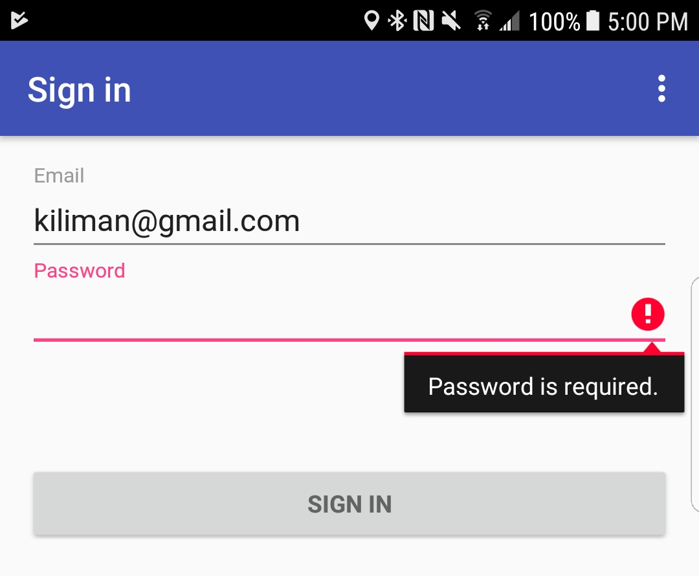

# MvxSamples Validation

This sample project shows how to use the [MvvmValidation](https://www.nuget.org/packages/MvvmValidation/) package to handle validation errors using MvvmCross data binding.

## Data Binding

In your binding statement, include the `Error Errors['PropertyName']` value. When we do the validation, any errors will be added to the `Errors` dictionary by *property name*. 

```xml
 <android.support.design.widget.TextInputLayout
        android:layout_width="match_parent"
        android:layout_height="wrap_content">

  <AutoCompleteTextView
    android:id="@+id/email"
    android:layout_width="match_parent"
    android:layout_height="wrap_content"
    android:hint="Email"
    android:inputType="textEmailAddress"
    android:maxLines="1"
    android:singleLine="true" 
    local:MvxBind="Text Email; Error Errors['Email']"/>

</android.support.design.widget.TextInputLayout>
```

## Validation

In your command handler, call the `Validate` method which you can use to verify the requied input. Any errors will be added to the `Errors` dictionary.

```c#
private bool Validate()
{
    _validator = new ValidationHelper();
    _validator.AddRequiredRule(() => Email, "Email is required.");
    _validator.AddRequiredRule(() => Password, "Password is required.");

    var result = _validator.ValidateAll();

    Errors = result.AsObservableDictionary();

    return result.IsValid;
}
```

## Result

